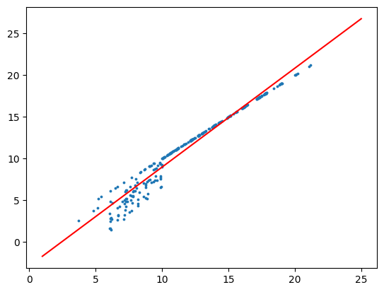
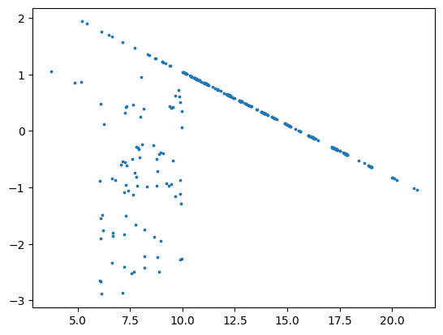
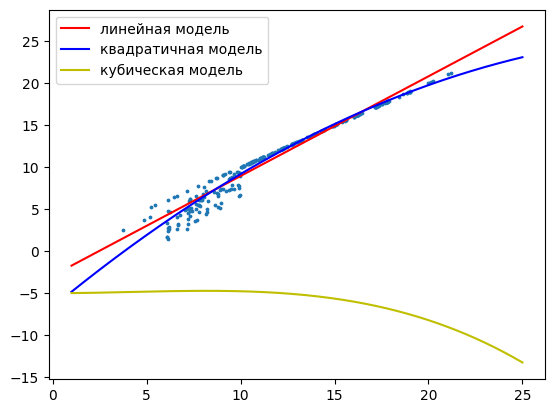

# Решение расчетно-графичкской работы №1 "Изучение парной регрессии"
### Студент: Кудрявцев Эдуард Сергеевич, M3335, 354409

## Задание 1
В качестве dataset'а были взяты погодные показания в венгерском городе Сегеде начала 2006 года

Ссылка на источник: https://www.kaggle.com/datasets/budincsevity/szeged-weather

Главным объектом анализа была зависимость показателя "Ощущаемая температура" от реальной температуры

## Задание 2

    

    

По корреляционному облаку наблюдаем возможную тесную прямую линейную связь между показателями

## Задание 3

Для всех дальнейших вычислений Возьмем уровень значимости как $\alpha=0,05$

Нормальность температуры и ощутимой температуры проверяем с помощью теста Д'Агостино-Пирсона

Далее посчитаем коэффициент корреляции Пирсона и проверим его значимость по t-статистике $t_н = \dfrac{|r|*\sqrt{n-2}}{\sqrt{1-r^2}}$

Доверительный интервал для него будет вычисляться с помощью Z-преобразования Фишера

    Нормальность X: True
    Нормальность Y: True
    
    Коэффициент корреляции Пирсона: 0.9806870859405218
    Значимость коэффициента корреляции Пирсона:
        Наблюдаемая статистика (модуль): 86.55790758983747
        Критическая статистика (модуль): 1.6499829759955271
        Значимость?: True
    Доверительный интервал: (0.9804330069494428, 0.980937897451177)

## Задание 4

    Уравнение регрессии: y = -2.911 + 1.187*x
    Коэффициент детерминации: 0.962
    F-статистика: 7492.271
    F-критическая: 0.004
    Значимоть уравнения (F-тест): True
    t-статистики: 
        a: -16.569
        b: 86.558
        Критическая: -1.650
    Значимость коэффициентов (t-тест)
        a: True
        b: True
    Средняя ошибка аппроксимации: 11.786%
    Средняя эластичность: 1.309

    График регрессии

    

    

## Задание 5:

Условия Гаусса-Маркова:
1. $\sum \epsilon_i=0$
2. $cov(\epsilon_i, \epsilon_{i-1}) = 0$
3. $\sigma^2_{\epsilon} = const$
4. $\epsilon_i$ имеет нормальное распределение

    График остатков

    

    

    Проверка условий Гаусса-Маркова
        1. Cумма остатков =0: True
        2. Отсутствие автокорреляции (тест Бройша-Годфрея): False
        3. Отсутствие гетероскедастичности (тест Уайта): False
        4. Нормальность остатков: True

## Задание 6

### Квадратичная модель

    Коэффициенты
    Intercept   -6.655228
    x            1.846937
    I(x ** 2)   -0.026277
    dtype: float64
    Можно ли заменить линейной?: True

### Кубическая модель

    Коэффициенты
    Intercept   -5.005055
    x            1.390192
    I(x ** 2)    0.012659
    I(x ** 3)   -0.001034
    dtype: float64
    Можно ли заменить линейной?: True

    

    

j-тест Стьюдента показал, что обе нелинейные модели можно заменить линейными, поэтому в дальнейшем продолжим работать именно с линейными моделями

## Задание 7

Вывод: действительно, между величинами наблюдается тесная линейная связь, однако присутствие автокорреляции и гетероскедастичности скорее всего говорят о необходимости перехода к многофакторным моделям для получения более точной аппроксимации
