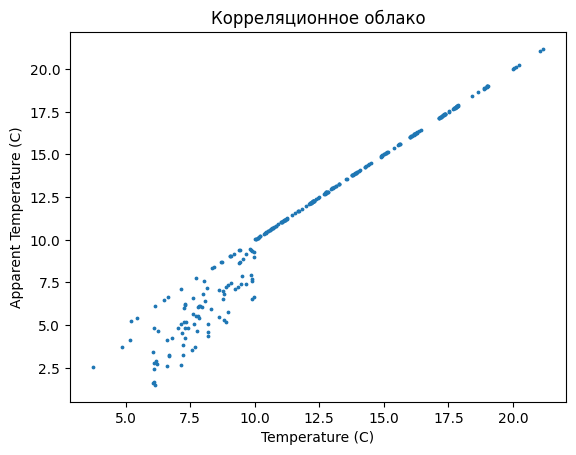
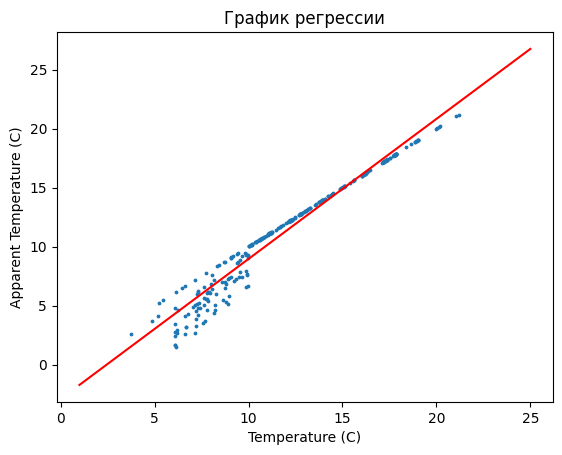
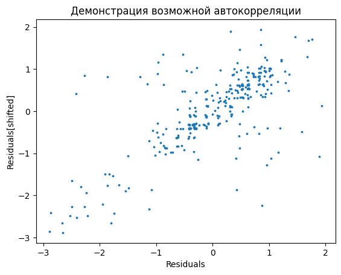
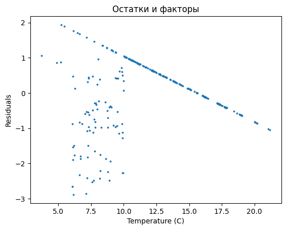
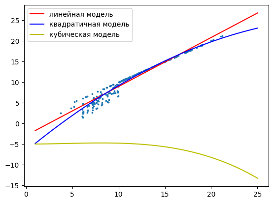

# Решение расчетно-графичкской работы №1 "Изучение парной регрессии"
### Студент: Кудрявцев Эдуард Сергеевич, M3335, 354409

## Задание 1
В качестве dataset'а были взяты погодные показания в венгерском городе Сегеде начала 2006 года

Ссылка на источник: https://www.kaggle.com/datasets/budincsevity/szeged-weather

Объектом анализа была зависимость показателя "Ощущаемая температура" от реальной температуры

## Задание 2

    

    

По корреляционному облаку наблюдаем возможную очень сильную прямую линейную связь между показателями

## Задание 3

Для всех дальнейших вычислений возьмем уровень значимости как $\alpha=0,05$

### Нормальность температуры и ощутимой температуры проверяем с помощью теста Д'Агостино-Пирсона:

$H_0$: данные взяты из нормального распределения

$H_1$: данные взяты не из нормального распределения

$A_s = \frac{\frac{1}{n} \sum_{i=1}^{n}(X_i - \bar{X})^3}{\left(\frac{1}{n} \sum_{i=1}^{n}(X_i - \bar{X})^2\right)^{3/2}}$

$Y = A_s \sqrt{\frac{(n+1)(n+3)}{6(n-2)}}$

$\beta_2 = \frac{3(n^2 + 27n - 70)(n+1)(n+3)}{(n-2)(n+5)(n+7)(n+9)}$

$W^2 = \sqrt{2\beta_2 - 1} - 1$

$\delta = 1 / \sqrt{\ln W}$

$\alpha = \sqrt{2 / (W^2 - 1)}$

$Z_1 = \delta \cdot \ln\left( \frac{Y}{\alpha} + \sqrt{ \left( \frac{Y}{\alpha} \right)^2 + 1 } \right)$

$E_s = \frac{\frac{1}{n} \sum_{i=1}^{n}(X_i - \bar{X})^4}{\left(\frac{1}{n} \sum_{i=1}^{n}(X_i - \bar{X})^2\right)^2} - 3$

$E (E_s) = -\frac{6}{n+1}$

$D_{E_s} = \frac{24n(n-2)(n-3)}{(n+1)^2(n+3)(n+5)}$

$X = \frac{E_s - E(E_s)}{\sqrt{D(E_s)}}$

$\beta_1 = \frac{6(n^2 - 5n + 2)}{(n+7)(n+9)} \sqrt{\frac{6(n+3)(n+5)}{n(n-2)(n-3)}}$

$A = 6 + \frac{8}{\beta_1} \left( \frac{2}{\beta_1} + \sqrt{1 + \frac{4}{\beta_1^2}} \right)$

$Z_2 = \frac{ \left(1 - \frac{2}{9A} \right) - \left( \frac{1 - 2/A}{1 + X \sqrt{2/(A-4)}} \right)^{1/3} }{ \sqrt{\frac{2}{9A}} }$

Статистика критерия: $\chi^2_н=Z_1^2+Z_2^2$ при верной нулевой гипотезе имеет распределение $\chi^2$ с двумя степенями свободы

Критическое значение для уровня значимости $\alpha$: $\chi^2_{кр}(\alpha, 2)$ - квантиль распределения $\chi^2$ с $2$ степенями свободы для уровня значимости $\alpha$.

В случае, если $\chi^2_н<\chi^2_{кр}$ гипотеза о нормальности данных не отвергается на данном уровне значимости. В противном случае она отвергается и констатируется обратное

### Далее посчитаем коэффициент корреляции Пирсона:

$r_{x, y}=\dfrac{1/n*\sum(y_i-y_{avg})(x_i-x_{avg})}{\sqrt{1/n*\sum(x_i-x_{avg})^2}*\sqrt{1/n*\sum(y_i-y_{avg})^2}}$

### Значимость коэффициента проверяется с помощью критерия Стьюдента:

$H_0: r_{x, y}=0$ коэффициент статистически незначим

$H_1: r_{x, y} \neq 0$ коэффициент статистически значим

Статистика: $t_н = \dfrac{|r|*\sqrt{n-2}}{\sqrt{1-r^2}}$ При верной нулевой гипотезе имеет распределение Стьюдента с n-2 степенями свободы.

Критическое значение для уровня значимости $\alpha$: $t_{кр}(\alpha, n-2)$ - квантиль распределения стьюдента с $n-2$ степенями свободы для уровня значимости $\alpha$.

В случае, если $|t_н|<|t_{кр}|$ гипотеза о статистической незначимости коэффициента корреляции не отвергается на данном уровне значимости. В противном случае она отвергается и констатируется статистическая значимость коэффициента корреляции Пирсона

### Доверительный интервал для него будет вычисляться с помощью Z-преобразования Фишера

$th( arcth(\hat{r}) - \dfrac{u_{\gamma}}{\sqrt{n-3}} ) < r_{x, y} < th( arcth(\hat{r}) + \dfrac{u_{\gamma}}{\sqrt{n-3}} )$, где $u_{\gamma}$ - квантиль стандартного нормального распределения уровня $1-\dfrac{\alpha}{2}$

    Нормальность X: True
    Нормальность Y: True
    
    Коэффициент корреляции Пирсона: 0.981
    Значимость коэффициента корреляции Пирсона:
        Наблюдаемая статистика (модуль): 86.558
        Критическая статистика (модуль): 1.650
        Значимость?: True
    Доверительный интервал: (0.976, 0.985)
    

## Задание 4

### Вычисление коэффициентов линейной регрессии

$X^T=X^T (Y-X \theta) = 0$

$X^T X \theta = X^T Y$

$\theta = (X^T X)^{-1} X^T Y$

### Коэффициент детерминации:

$R^2=1-\dfrac{\sum \epsilon_i^2}{n-2}$ - показывает, насколько хорошо модель описывает зависимость значений данных

### Значимость уравнения регрессии проверяется с помощью F-теста

$H_0: D_{факт}=D_{остат}$ Модель статистически незначима

$H_1: D_{факт} \neq D_{остат}$ Модель статистически значима

Статистика критерия: $F_н=\dfrac{D_{факт}}{D_{остат}}=\dfrac{RSS/m}{ESS/(n-m-1)}$, где m - количество факторов$(m=1)$. $RSS= \sum (\hat{y_i}-y_{avg})^2$ $ESS= \sum (y_i - \hat{y_i})^2$, при верной нулевой гипотезе имеет распределение Фишера-Снедекора со степенями свободы $m$ и $n-m-1$

Критическая статистика - квантиль распределения Фишера-Снедекора с вышеупомянутыми степенями свободы и с заданным уровнем значимости $\alpha$

В случае если $F_н < F_{кр}$, нулевая гипотеза не отвергается, а в противном случае отвергается и принимается альтернативная гипотеза о статистической значимости уравнения регрессии

### Значимость коэффициентов модели проверяется с помощью t-теста

$H_0: \theta_i=0$

$H_1: \theta_i \neq 0$

Статистика $t_н=\dfrac{\hat{\theta_i}}{S_{\theta_i}}$, где $S_{\theta_i}$ - стандартная ошибка коэффициента, $S_a = \dfrac{s * \sqrt{\sum x_i^2}}{\sqrt{n \sum (x_i - x_{avg})^2}}$, $S_b = \dfrac{s}{\sqrt{n \sum (x_i - x_{avg})^2}}$, $s^2=\dfrac{ \sum \epsilon_i^2 }{n - 2}$, при верной нулевой гипотезе имеет распределение Стьюдента с n-2 степенями свободы.

Расчет критического значения и проверка гипотез аналогичны оным при проверке значимости коэффициента корреляции Пирсона.

### Средняя ошибка аппроксимации

$A_{avg}=\dfrac{1}{n} \sum |\dfrac{y_i-\hat{y_i}}{y_i}|*100$%

Показывает, на сколько % в среднем модель ошибается в расчетах

### Средняя эластичность

$E_{avg} = b*\dfrac{x_{avg}}{y_{avg}}$

Показывает, на сколько % в среднем увеличивается $y$, если увеличить $x$ на 1%

    Уравнение регрессии: y = -2.911 + 1.187*x
    Коэффициент детерминации: 0.962
    F-статистика: 7492.271
    F-критическая: 0.004
    Значимоть уравнения (F-тест): True
    t-статистики: 
        a: -16.569
        b: 86.558
        Критическая: -1.650
    Значимость коэффициентов (t-тест)
        a: True
        b: True
    Средняя ошибка аппроксимации: 11.786%
    Средняя эластичность: 1.373

Коэффициент детерминации демонстрирует, что линейная модель описывает зависимость показателей довольно неплохо, а коэффициенты регрессии и эластичности говорят о том, что показания ощутимой температуры и температуры реальной оказались приблизительно сравнимыми, что вполне себе логично.

    

    

## Задание 5:

### Условия Гаусса-Маркова:
1. $\sum \epsilon_i=0$ - Сумма остатков равна нулю
2. $cov(\epsilon_i, \epsilon_{i-1}) = 0$ - Отсутствие автокорреляции
3. $\sigma^2_{\epsilon} = const$ - Отсутствие гетероскедастичности
4. $\epsilon_i$ имеет нормальное распределение

### Отсутствие автокорреляции: тест Бройша-Годфри

$H_0:$ Не имеется автокорреляции порядка p

$H_1:$ Имеется автокорреляции порядка p

1. Строится первичная регрессия, находится ряд остатков
2. Строится вспомогательная регрессия $\epsilon_t = a_0 + a_1 x_t + \sum_1^p b_i \epsilon_{t-i}$
3. Статистика критерия: $\chi^2_н=nR^2$ при верной нулевой гипотезе имеет распределение $\chi^2$ с $p$ степенями свободы
4. Если $\chi^2_н>\chi^2_{кр}$, то нулевая гипотеза отвергается и имеется автокорреляция

### Отсутствие гетероскедастичности: тест Уайта

$H_0: \sigma_{\epsilon}=const$

$H_1: \sigma_{\epsilon} \neq const$

1. Строится первичная регрессия, находится ряд остатков
2. Строится регрессия $\epsilon_i^2$ на константу, $x_i$, $x_i^2$ $x_i*x_j$
3. Статистика критерия: $\chi^2_н=nR^2$ при верной нулевой гипотезе имеет распределение $\chi^2$ с $m-1$ степенями свободы, где $m$ - количество регрессоров во вторичной модели
4. Если $\chi^2_н>\chi^2_{кр}$, то нулевая гипотеза отвергается и имеется гетероскедастичность

    

    

    

    

    Проверка условий Гаусса-Маркова
        1. Cумма остатков =0: True
        2. Отсутствие автокорреляции (тест Бройша-Годфри): False
        3. Отсутствие гетероскедастичности (тест Уайта): False
        4. Нормальность остатков: True

## Задание 6

Поскольку содержательный смысл переменных подсказывает о полной бессмысленности построения нелинейных моделей, а выполнять данное задание как-то необходимо, нелинейные модели были выбраны исходя из принципа "просто потому что" и для обеих с помощью j-теста Стьюдента были проверены гипотезы о возможности их замены на линейную. Как следствие, лучшая из них не выбиралась

### j-тест Стьюдента

$H_0: R^2-r^2=0$ - можно заменить модель линейной

$H_1: R^2-r^2 \neq 0$ - замена модели линейной невозможна

Статистика критерия: $t_н=\dfrac{R^2-r^2}{2 \sqrt{\dfrac{(R^2-r^2)-(R^2-r^2)^2(2-(R^2+r^2))}{n}}}$

Проверка гипотезы происходит аналогичным предыдущим тестам с использованием распределения Стьюдента образом

### Квадратичная модель

    Коэффициенты
    Intercept   -6.655228
    x            1.846937
    I(x ** 2)   -0.026277
    dtype: float64
    Можно ли заменить линейной?: True

### Кубическая модель

    Коэффициенты
    Intercept   -5.005055
    x            1.390192
    I(x ** 2)    0.012659
    I(x ** 3)   -0.001034
    dtype: float64
    Можно ли заменить линейной?: True

    

    

j-тест Стьюдента показал, что обе нелинейные модели можно заменить линейными, поэтому в дальнейшем продолжим работать именно с линейными моделями

## Задание 7

Вывод: действительно, между величинами наблюдается очень сильная линейная связь, однако присутствие автокорреляции и гетероскедастичности скорее всего говорят о необходимости перехода к многофакторным моделям для получения более точной аппроксимации
